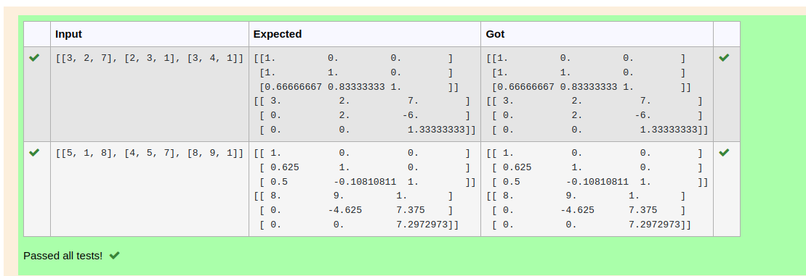
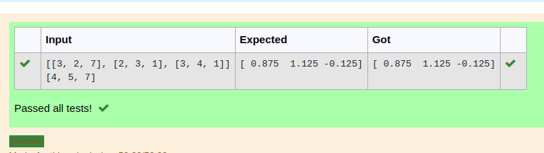

# LU Decomposition 

## AIM:
To write a program to find the LU Decomposition of a matrix.

## Equipments Required:
1. Hardware – PCs
2. Anaconda – Python 3.7 Installation / Moodle-Code Runner

## Algorithm
1. Import the NumPy and SciPy libraries using the commands "import numpy as np" and "from scipy.linalg import lu"

2. Define a variable "A" as a NumPy array created from user input. The user input should be a list or array in the form of a string, which is evaluated using the "eval" function.

3. Use the SciPy function "lu()" to decompose the matrix "A" into its lower triangular matrix "L", upper triangular matrix "U" and a permutation matrix "P". This function takes the matrix A as input and returns three matrices L, U and P.

4. Print the lower triangular matrix L and upper triangular matrix U using the print() function.


## Program:
(i) To find the L and U matrix
```
/*
Program to find the L and U matrix.
Developed by: Nithyaa sri S s
RegisterNumber: 22008434
import numpy as np
from scipy.linalg import lu
A=np.array(eval(input()))
P,L,U=lu(A)
print(L)
print(U)
*/
```
(ii) To find the LU Decomposition of a matrix
```
/*
Program to find the LU Decomposition of a matrix.
Developed by: Nithyaa sri S S
RegisterNumber:22008434
import numpy as np
from scipy.linalg import lu_factor,lu_solve
A=np.array(eval(input()))
b=np.array(eval(input()))
lu,piv=lu_factor(A)
x=lu_solve((lu,piv),b)
print(x) 
*/
```

## Output:





## Result:
Thus the program to find the LU Decomposition of a matrix is written and verified using python programming.

